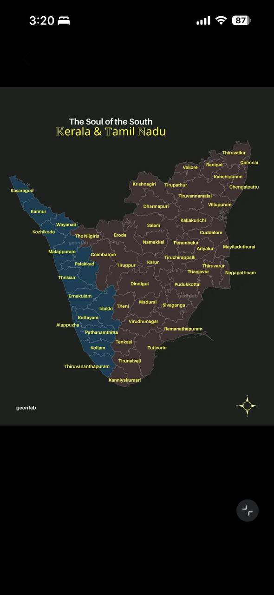

# mapdrill


A self-hosted geography drill: given a map divided into named subdivisions,
you name them.



## Modes

**Free Recall.** One always-focused text box sits over the map. Type any
subdivision's name, in any order, and it matches on keystroke. Correct
answers fill the subdivision green and reveal its label. There's no
clicking — just type until the map is full or you give up.

**Pin & Name.** Click an unnamed subdivision to arm it, then type its name;
only that subdivision counts while it's armed. Get it right first try and
it fills green; get it right after a retry and it fills amber instead.
Both modes share a Give Up action that fills every unsolved subdivision red
with its label, freezes the timer, and offers to replay just the misses as
a fresh session.

## Quickstart

```sh
git clone <repo-url> mapdrill
cd mapdrill
nvm use   # Node 22, see .nvmrc
npm install
npm run dev
```

## Adding a map pack

Map packs are pluggable JSON — see [`docs/PACK-SPEC.md`](docs/PACK-SPEC.md)
for the format and [`packs/LICENSE-DATA.md`](packs/LICENSE-DATA.md) for the
licensing/attribution bar a pack's geometry has to clear. The first pack is
the 52 districts of Kerala (14) and Tamil Nadu (38), South India.

## License

Code is MIT (see [`LICENSE`](LICENSE)). Map pack data is licensed
separately, per pack — see [`packs/LICENSE-DATA.md`](packs/LICENSE-DATA.md).
